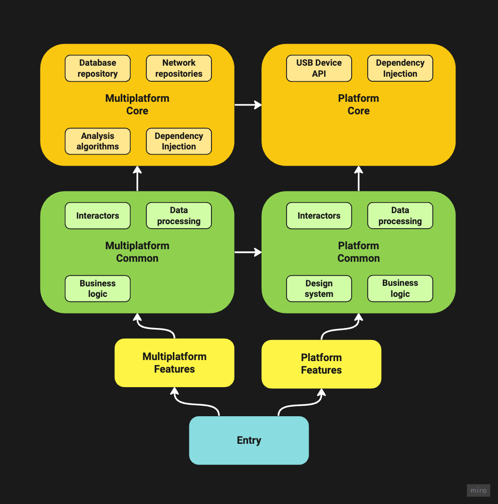
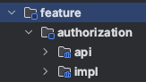
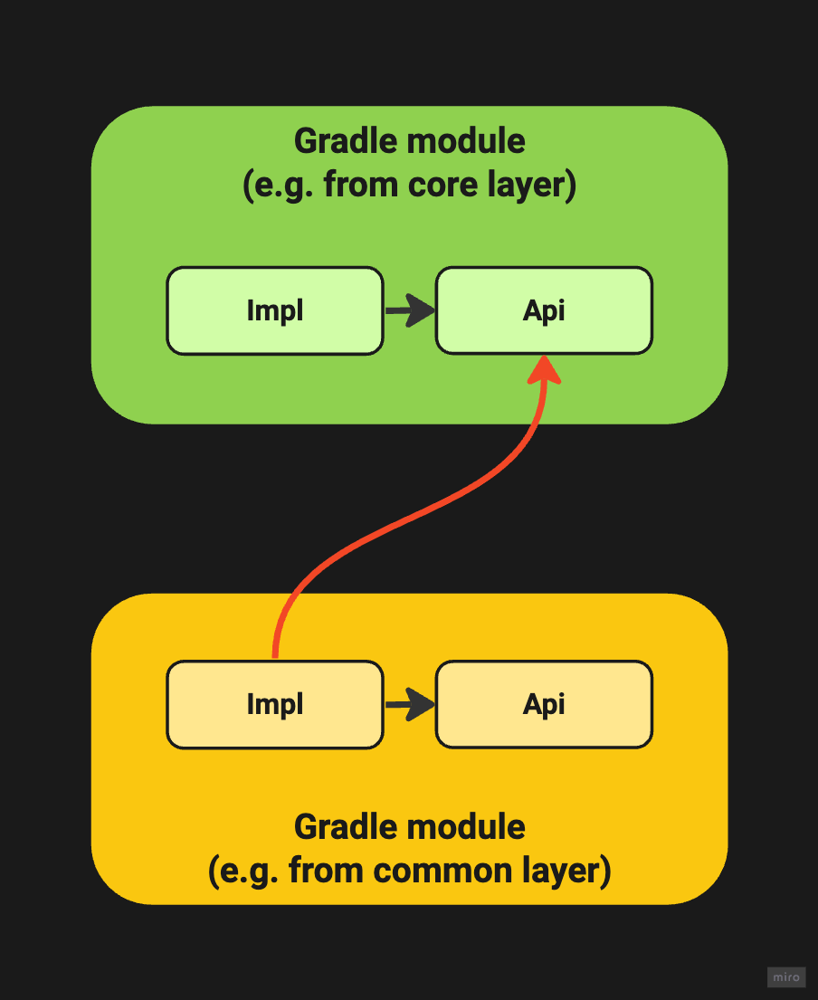

# Architecture

## Project structure

I tried to adapt the hexagonal architecture to the world of mobile development, taking into account the fact that I would really like to use Kotlin Multiplatform

Project structure diagram (the direction of the arrows indicates “depends on”):

A few clarifications:

1) Entry layer is a layer with entry points in the application. Here the **Activity** and **Aplication** classes, navigation are stored, and the **DI** graph is initialized
2) Features layer - this is a layer with specific features. In the case of a mobile application, this layer stores the UI of a specific screen and the logic associated only with updating the UI (for example, **ViewModel** or **Store** from **Redux**)
3) Common layer is a layer with entities that can be used in several Feature layers. For example, an interactor who must give sensor data to a concentration game.
4) Core layer is a layer with the most abstract entities that do not depend in any way on a specific feature. For example, repository classes for receiving data from a network or from a sensor.

> Layers of the same level should generally not depend on each other!

## Gradle modules

### Gradle module structure

* Inside the **Gradle** module, in general we use the **api/impl** scheme. **api module** contains a public API for using the module in other modules. **impl-module** contains the implementation of this module, which clients of this module do not need to know about

     Example:

     

* One **Gradle module** is connected to another **Gradle-module** according to the following principle: (the direction of the arrows indicates “depends on”):

     

### buildSrc module

This module is designed to store dependencies and their versions

The module itself has the following divisions:
* **const**
  * **CompileVersions** - needed to highlight the build version of the project
  * **Dependecies** - contains all the necessary versions and dependencies
* **conventions**
  - **base** - basic conventions that contain the initial settings
  - **module** - conventions that extend the **base** conventions of the minimum level of use
  - **moduleExtended** - conventions that extend **module** conventions with specific dependencies (e.g. Jetpack Compose)
